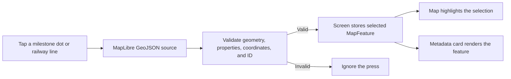

# From a map press to a metadata card

On the native map, tapping a railway line or a milestone selects one railway feature and opens its metadata card. The map adapter identifies the feature; the map screen owns the selection; the card presents it. This guide follows that path so a new developer knows where to make a change.



## Follow a milestone tap

1. [`Map`](../src/components/adapters/map/map.tsx) renders the milestone GeoJSON source and forwards its `onFeaturePress` callback. Milestone dots appear from zoom 10; their labels appear from zoom 13.
2. [`MilestoneLayer`](../src/components/adapters/map/milestone-layer.tsx) receives the MapLibre press event. It takes the first valid pressed point, checks its railway identity and label, validates its coordinates, builds a `Milestone`, and checks that the GeoJSON feature ID matches the domain ID. Invalid hits do nothing.
3. For a valid hit, the layer stops event propagation and calls `onFeaturePress(milestone)`.
4. [`useMapSelection`](../src/features/map-screen/use-map-selection.ts) stores `{ feature: milestone, origin: "map" }` and exits map-only mode if it was active. The route passes the same selected feature back to the map and to [`MapFeatureDetailsCard`](../src/components/composites/map-feature-details-card/index.tsx).
5. The map highlights the selected milestone dot **and** its parent railway section. The card shows the milestone's railway metadata and coordinates.

For example, tapping **PK 509+000** on line **893000**, section **1**, opens a card like this:

```text
POINT KILOMÉTRIQUE
PK 509+000

Code ligne    893000
Section       1
Repère        509+000
Coordonnées   45.74744 N · 4.85933 E
```

The card formats milestone coordinates to five decimal places. Its west-hemisphere label is `W`.

## Railway lines follow the same path

[`RailwayLinesSource`](../src/components/adapters/map/railway-lines-source.tsx) handles a pressed line. It accepts only valid `LineString` or `MultiLineString` features with complete railway properties and a matching section ID. It constructs a `Railway` and selects its `RailwaySection` child. The map highlights that section in orange, while the card shows the railway name, line code, section rank, and start-to-end milestone range. A railway card does not show coordinates.

Milestone dots and labels render above railway lines. This preserves their visual and press priority where features overlap. Tapping another valid feature replaces the single current selection and updates both the highlight and card.

## What changes or clears the card?

| Action                                      | Result                                                                                                  |
| ------------------------------------------- | ------------------------------------------------------------------------------------------------------- |
| Tap another valid milestone or railway line | Replace the selected feature and card contents.                                                         |
| Tap the card's close button                 | Clear selection, highlight, and card.                                                                   |
| Hide the selected feature's layer           | Clear selection and card; hiding the other layer keeps them. Hidden layers do not handle presses.       |
| Enter map-only mode                         | Hide the overlays, including the card. A valid feature press exits map-only mode and displays its card. |

The route renders the card only when a feature is selected and native overlays are visible. The web map is an accessible fallback, not the interactive MapLibre map.

## A map tap is not a simulation request

`useMapSelection` records where a milestone came from. A tapped map milestone has `origin: "map"` and is for inspection. A milestone chosen through point search has `origin: "search"`; that path also makes the milestone available to the simulation start control and requests camera focus. The metadata card can look the same in both cases, but tapping a map marker alone never starts a location simulation. If a simulation is already running, its stop control stays available independently of which card is open.

## Where to change behavior

| Need                                                        | Start here                                                                                                                                                                                                                        |
| ----------------------------------------------------------- | --------------------------------------------------------------------------------------------------------------------------------------------------------------------------------------------------------------------------------- |
| Recognize a different GeoJSON hit or change validation      | [`milestone-layer.tsx`](../src/components/adapters/map/milestone-layer.tsx) or [`railway-lines-source.tsx`](../src/components/adapters/map/railway-lines-source.tsx)                                                              |
| Change selection, layer hiding, close, or map-only behavior | [`use-map-selection.ts`](../src/features/map-screen/use-map-selection.ts)                                                                                                                                                         |
| Change what metadata appears                                | [`map-feature-details-presentation.ts`](../src/components/composites/map-feature-details-card/map-feature-details-presentation.ts) and [`MapFeatureDetailsCard`](../src/components/composites/map-feature-details-card/index.tsx) |
| Check the complete interaction on Android                   | [Map-feature selection Maestro flow](../.maestro/tests/manage-map-feature-selection.yaml)                                                                                                                                         |

The route that connects these pieces is [`src/app/index.tsx`](../src/app/index.tsx). The map adapter renders and reports presses; it does not own the selected feature or load railway data.
