# From railway search to simulation start

This guide follows a user from **Rechercher un point** to a confirmed simulation start. It ends when Android applies the first mock location fix and the app reports `running`. For what happens after that, see the [simulation lifecycle guide](../src/features/simulation/README.md).

```mermaid
flowchart LR
    Open[Open point search] --> Line[Find and choose a railway line]
    Line --> Section[Choose a section if needed]
    Section --> Input[Enter a kilometre and metric part]
    Input --> Resolve[Resolve a Milestone from SQLite]
    Resolve --> Use[Use this point]
    Use --> Selected[Searched milestone selected on map]
    Selected --> Start[Press Start simulation]
    Start --> Ready[Check Android readiness]
    Ready --> Fix[Apply first mock fix from selected Milestone]
    Fix --> Running[Running]
```



## 1. Search for a railway point

The map toolbar opens the point-search sheet and asks the railway-reference provider to load its searchable lines. The provider reads the bundled SQLite railway reference; the map itself does not perform the search.

The form has three steps:

1. **Line.** Search by the beginning of a line code or by at least two letters of its name. Name search ignores accents and case. Results are limited to 20. Choose a railway line from the results.
2. **Section.** Choose a section of that line. If the line has exactly one section, the form selects it automatically.
3. **Kilometre point.** Enter the kilometre and three-digit metric part, such as `509` and `000` for **PK 509+000**. A complete `509+000` value can also be pasted. The point must fall within the selected section's known range.

For example, searching for code **893000** finds **Ligne de Collonges-Fontaines à Lyon-Guillotière**. Selecting its section **1**, then entering `509` + `000`, requests the point at **509,000 metres** along that section.

[`usePointSearchForm`](../src/components/composites/map-toolbar/point-search-sheet/use-point-search-form.ts) holds the form state. [`searchRailways`](../src/features/milestones/search/railway-search.ts) filters the loaded lines, while [`validateMilestoneInput`](../src/features/milestones/search/milestone-input.ts) checks the entered point.

## 2. Resolve and select the milestone

Once the input is valid, [`useMilestoneResolution`](../src/components/composites/map-toolbar/point-search-sheet/use-milestone-resolution.ts) calls `findMilestone` with the line code, section rank, and position in metres. The SQLite repository returns a `Milestone` domain object containing its identity, label, and coordinates. A stale result from an earlier input is ignored.

The sheet shows a resolved-point summary, then enables **Utiliser ce point** only when resolution is `ready`. A missing point, out-of-range value, or lookup error does not enable that action.

Pressing **Utiliser ce point** closes the sheet. [`useMapSelection`](../src/features/map-screen/use-map-selection.ts) records the feature with `origin: "search"`, makes the milestone layer visible, and requests camera focus. The selected milestone is highlighted and its [metadata card](map-interactivity.md) appears. Its search origin also makes it eligible for the simulation start control; tapping the same point directly on the map is inspection only.

## 3. Press start

[`useMapLocation`](../src/features/map-screen/use-map-location.ts) passes the searched milestone to [`useSimulation`](../src/hooks/features/use-simulation.ts). Pressing **Démarrer la simulation** calls the simulation controller, which proceeds in this order:

```text
Check: AROW is the selected mock-location app
Check: Android location services are enabled
Check: fine location permission is granted
        ↓ only if ready
Start the Android executor with the selected Milestone's coordinates
        ↓ only after the first fix is applied
Report running
```

The search sheet performs the only milestone lookup. The selected `Milestone` already contains validated coordinates, and the bundled reference cannot change between selection and start. Readiness runs before native start, so a missing mock-app selection or disabled location services fails quickly without applying a fix. Native start also checks readiness before applying a fix. A start request alone is **not** reported as success.

For the example above, the selected `Milestone` resolves to approximately **45.74744 N, 4.85933 E**. The journey reaches its endpoint only when the native result confirms that those coordinates were applied and the UI enters `running`.

## Where to look in code

| Responsibility                                                       | File                                                                                                                                                                    |
| -------------------------------------------------------------------- | ----------------------------------------------------------------------------------------------------------------------------------------------------------------------- |
| Open/close the sheet and hand the chosen milestone to the map screen | [`map-toolbar/index.tsx`](../src/components/composites/map-toolbar/index.tsx)                                                                                           |
| Form stages, selection, and resolved-point feedback                  | [`point-search-sheet/`](../src/components/composites/map-toolbar/point-search-sheet/)                                                                                   |
| Read lines and milestones from the bundled database                  | [`railway-reference/provider.tsx`](../src/features/railway-reference/provider.tsx) and [`sqlite/repository.ts`](../src/features/railway-reference/sqlite/repository.ts) |
| Preserve the searched origin and request map focus                   | [`use-map-selection.ts`](../src/features/map-screen/use-map-selection.ts)                                                                                               |
| Check readiness and confirm start                                    | [`simulation-controller.ts`](../src/features/simulation/simulation-controller.ts)                                                                                       |

The [milestone Maestro journey](../.maestro/tests/mock-phone-location.yaml) exercises the search, selection, and fail-fast mock-app check. Its assertions stop before a successful native start, so a change to first-fix acknowledgement also needs a focused Android check.
