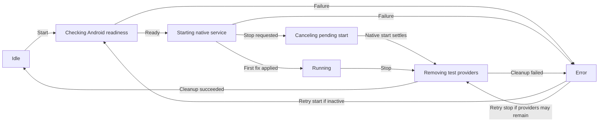

# Milestone location simulation

This guide describes the **local Android simulation** started from a selected railway milestone. It is separate from the future AROW Desktop communication protocol. The app reports a simulation as running only after Android has applied its first mock location fix.

## Where to start reading

| File                                                                                                                                       | Responsibility                                                                            |
| ------------------------------------------------------------------------------------------------------------------------------------------ | ----------------------------------------------------------------------------------------- |
| [`simulation-provider.tsx`](simulation-provider.tsx)                                                                                       | Application-scoped owner of one controller, foreground reconciliation, and running polls. |
| [`use-simulation.ts`](use-simulation.ts)                                                                                                   | React adapter: exposes the provider's `start`, `stop`, and `state` to screen consumers.   |
| [`simulation-controller.ts`](simulation-controller.ts)                                                                                     | Orders operations, handles cancellation, publishes UI state, and reconciles native state. |
| [`simulation-state.ts`](simulation-state.ts)                                                                                               | UI state variants and typed predicates such as `isSimulationStopRequired`.                |
| [`mock-location.ts`](mock-location.ts)                                                                                                     | Loads the Android executor and defines the operations the controller needs.               |
| [`simulation-native-snapshot.ts`](simulation-native-snapshot.ts)                                                                           | Converts an applied native fix to a `LocationDescriptor`.                                 |
| [`native-contracts.ts`](../../../modules/arow-mock-location/src/native-contracts.ts)                                                       | Readiness, snapshot, start, and stop result contracts.                                    |
| [`decode-native-result.ts`](../../../modules/arow-mock-location/src/decode-native-result.ts)                                               | Validates responses from the native bridge before the controller sees them.               |
| [`MockLocationEngine.kt`](../../../modules/arow-mock-location/android/src/main/java/expo/modules/arowmocklocation/MockLocationEngine.kt)   | Owns the Android simulation state and test providers.                                     |
| [`MockLocationService.kt`](../../../modules/arow-mock-location/android/src/main/java/expo/modules/arowmocklocation/MockLocationService.kt) | Runs with a notification and refreshes fixes while the app is backgrounded.               |

The map screen composes real location and simulation in [`use-map-location.ts`](../map-screen/use-map-location.ts). It supplies the action to the location bar and keeps the stop control available after the milestone card closes.

## Lifecycle at a glance

The diagram shows the usual path. A stop during `checking` cancels the pending work and returns to `idle`. A stop during `starting` immediately enters `canceling`, waits for the native start result, then enters `stopping` and calls native stop. Neither state claims cleanup succeeded while it is pending.

### Start, step by step

1. The location control calls `useMapLocation.onSimulationPress`, which passes the **selected searched milestone** to `useSimulation.start`. A map feature selected only for inspection is not a simulation target.
2. The point-search sheet has already resolved the `Milestone` domain object and its coordinates. `SimulationController` checks Android readiness before applying it: AROW must be the selected mock-location app, location services must be enabled, and fine location permission must be granted.
3. The controller passes that milestone's coordinates to the native executor without another lookup. The native module checks readiness again, starts the notification-backed service, installs GPS and network test providers, and injects the first fix. Native `start` returns `running` only after that fix is applied. Later fixes receive fresh timestamps roughly every second.
4. The bridge decoder validates the result. The controller converts a valid `NativeRunningSnapshot` to a `LocationDescriptor` with `accuracy` and `heading` set to `null`, then publishes `running`.

For example, selecting PK 509+000 on line 893000 resolves the milestone in the search sheet; the Android executor receives that object's latitude and longitude. The UI can show `running` only after native start returns an applied fix. A failed readiness check prevents native start.

### Stop and cleanup

While running, the location control invokes `stop` even if the selected feature card has closed or another map feature is selected. The controller publishes `stopping` with the last applied position, then calls native stop. It also uses this same cleanup path after a canceled start or an active error without a known position. Repeated stop presses during `canceling` or `stopping` have no effect. The engine removes only its owned test providers; the native module then stops the foreground service. The UI returns to `idle` only when native stop reports `stopped`.

If removal fails, native returns an `error` with `ownsProviders`. The controller uses that boolean for `mayBeActive`: `true` keeps an actionable **retry stop** control. It may retain the last applied position for display, but error coordinates are never treated as a new applied fix. A malformed stop response is handled conservatively as uncertain cleanup rather than success.

## UI state versus native state

`SimulationState` is a UI/workflow state (`idle`, `checking`, `starting`, `canceling`, `running`, `stopping`, or `error`). `canceling` and `stopping` make pending cleanup visible without private lifecycle flags. Native snapshots have their own variants (`stopped`, `starting`, `running`, or `error`). The bridge decoder checks required fields, known codes, coordinate ranges, and provider ownership once, before a snapshot reaches the controller.

The root layout mounts `SimulationProvider` around the route stack. It creates one controller for the application session, reconciles from a native snapshot when it mounts and whenever the app becomes active, and polls every two seconds while running. `useSimulation` reads the provider's state and actions; closing or remounting the map screen cannot create another controller or interrupt an operation. Operation and snapshot sequence numbers prevent late reads from overwriting a newer start or stop. When the root provider unmounts, it removes its React listener and poller but does **not** call native stop. The Android service can therefore continue sending fixes while the app is in the background. A new JS session creates a new controller and reconciles from native state. The service is not configured to restart after task removal, process termination, or device reboot.

An invalid native snapshot produces an actionable `SIMULATION_UNAVAILABLE` error with uncertain active state, even on initial reconciliation. When the native snapshot says `stopped`, the controller clears a state that still requires stopping. After a successful stop, map coordination retries the real-location watcher so the displayed position can return to the device's real location.

## Working on this workflow

- Keep the ordering **search-sheet milestone lookup → readiness → native start → first-fix acknowledgement**. Do not infer success from a request to start the service.
- Keep native resource ownership explicit. If a provider remains after partial cleanup, report it through `ownsProviders`; never infer ownership from an error code.
- Keep UI state and native bridge contracts distinct. Add or change a native result in the Kotlin contracts, TypeScript contracts, decoder, and controller together.
- Cover races in [`simulation-controller.test.ts`](simulation-controller.test.ts), bridge shapes in [`decode-native-result.test.ts`](../../../modules/arow-mock-location/src/decode-native-result.test.ts), and hook reconciliation in [`use-simulation.test.ts`](use-simulation.test.ts). For an Android behavior change, exercise the affected path on an emulator; [`mock-phone-location.yaml`](../../../.maestro/tests/mock-phone-location.yaml) covers the milestone journey and fail-fast mock-app check.
